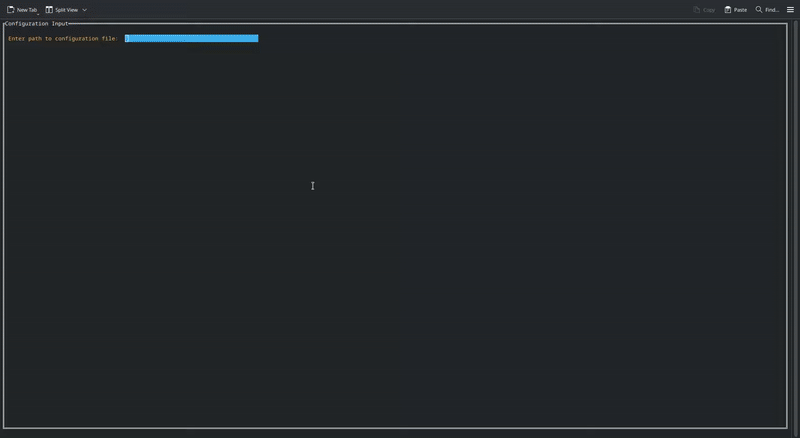

# ApiGorowler

**ApiGorowler** is a declarative, YAML-configured API crawler designed for complex and dynamic API data extraction. It allows developers to describe multi-step API interactions with support for nested operations, data transformations, and context-based processing.

The core functionality of ApiGorowler revolves around two main step types:

* `request`: to perform API calls,
* `foreach`: to iterate over arrays and dynamically create nested contexts.

Each step operates in its own **context**, allowing for precise manipulation and isolation of data. Contexts are pushed onto a stack, especially by `foreach` steps, enabling fine-grained control of nested operations. After execution, contexts can be merged into parent or ancestor contexts using declarative **merge rules**.

ApiGorowler also supports:

* Static iteration using `values` in `foreach`
* Response transformation via `jq` expressions
* Request templating with Go templates
* Global and request-level authentication and headers
* Multiple authentication mechanisms: OAuth2 (with password and client\_credentials flows), Bearer tokens, and Basic auth
* Streaming of top-level entities when operating on array-based root contexts

To simplify development, ApiGorowler includes a **configuration builder CLI tool**, written in Go, that enables real-time execution and inspection of the configuration. This tool helps developers debug and refine their manifests by visualizing intermediate steps.

The library comes with a [developer IDE](cmd/ide/) which helps in building, debugging and analyze crawl configuration.




---

## Features

* Declarative configuration using YAML
* Supports nested data traversal and merging
* Powerful context stack system for scoped operations
* Built-in support for `jq` and Go templates
* Multiple authentication types (OAuth2, Basic, Bearer)
* Config builder with live evaluation and inspection
* Streaming support for root-level arrays

---

## Context Example

The configuration

```yaml
rootContext: []
  
steps:
  - type: request
    name: Fetch Facilities
    request:
      url: https://www.foo-bar/GetFacilities
      method: GET
      headers:
        Accept: application/json
    resultTransformer: |
      [.Facilities[]
        | select(.ReceiptMerchant == "STA – Strutture Trasporto Alto Adige SpA Via dei Conciapelli, 60 39100  Bolzano UID: 00586190217")
      ]
    steps:
      - type: forEach
        path: .
        as: facility
        steps:
          - type: request
            name: Get Facility Free Places
            request:
              url: https://www.foo-bar/FacilityFreePlaces?FacilityID={{ .facility.FacilityId }}
              method: GET
              headers:
                Accept: application/json
            resultTransformer: '[.FreePlaces]'
            mergeOn: .FacilityDetails = $res

          - type: forEach
            path: .subFacilities
            as: sub
            steps:
              - type: request
                name: Get SubFacility Free Places
                request:
                  url: https://www.foo-bar/FacilityFreePlaces?FacilityID={{ .sub.FacilityId }}
                  method: GET
                  headers:
                    Accept: application/json
                resultTransformer: '[.FreePlaces]'
                mergeOn: .SubFacilityDetails = $res

              - type: forEach
                path: .locations
                as: loc
                steps:
                  - type: request
                    name: Get Location Details
                    request:
                      url: https://www.foo-bar/Locations/{{ .loc }}
                      method: GET
                      headers:
                        Accept: application/json
                    mergeWithContext:
                      name: sub
                      rule: ".locationDetails = (.locationDetails // {}) + {($res.id): $res}"
```

Generates a Context tree like

```
rootContext: []
│
└── Request: Fetch Facilities
    (result is filtered list of Facilities)
    │
    └── Foreach: facility in [.]
        (new context per facility)
        │
        ├── Request: Get Facility Free Places
        │   (adds .FacilityDetails to ancestor context via mergeOn)
        │
        └── Foreach: sub in .subFacilities
            (new context per sub-facility)
            │
            ├── Request: Get SubFacility Free Places
            │   (adds .SubFacilityDetails to ancestor context via mergeOn)
            │
            └── Foreach: loc in .locations
                (new context per location ID)
                │
                └── Request: Get Location Details
                    (merges $res into sub context under .locationDetails via mergeWithContext)
```

-----

## Configuration Structure

### Top-Level Fields

| Field         | Type                   | Description                                                    |
| ------------- | ---------------------- | -------------------------------------------------------------- |
| `rootContext` | `[]` or `{}`           | **Required.** Initial context for the crawler.                 |
| `auth`        | `AuthenticationStruct` | Optional. Global authentication configuration.                 |
| `headers`     | `map[string]string`    | Optional. Global headers.                                      |
| `stream`      | `boolean`              | Optional. Enable streaming; requires `rootContext` to be `[]`. |
| `steps`       | `Array<ForeachStep\|RequestStep>` | **Required.** List of crawler steps. |

---

### AuthenticationStruct

| Field          | Type   | Required When                                                |
| -------------- | ------ | ------------------------------------------------------------ |
| `type`         | string | Always. One of: `basic`, `bearer`, `oauth`                   |
| `token`        | string | If `type == bearer`                                          |
| `method`       | string | If `type == oauth`. One of: `password`, `client_credentials` |
| `tokenUrl`     | string | If `type == oauth`                                           |
| `clientId`     | string | If `type == oauth && method == client_credentials`           |
| `clientSecret` | string | If `type == oauth && method == client_credentials`           |
| `username`     | string | If `type == basic` or `type == oauth && method == password`  |
| `password`     | string | If `type == basic` or `type == oauth && method == password`  |

---

### ForeachStep

| Field               | Type                 | Description                                          |
| ------------------- | -------------------- | ---------------------------------------------------- |
| `type`              | string               | **Required.** Must be `foreach`                      |
| `name`              | string               | Optional name for the step                           |
| `path`              | jq expression        | **Required.** Path to the array to iterate over      |
| `as`                | string               | **Required.** Variable name for each item in context |
| `values`            | array<any>           | Optional. Static values to iterate over, when using values in the url you need to access the current iteration value using `.[ctx-name].value` (example)[./examples/foreach-iteration.yaml]             |
| `steps`             | Array<ForeachStep\|RequestStep> | Optional. Nested steps |
| `mergeWithParentOn` | jq expression        | Optional. Rule for merging with parent context       |
| `mergeOn`           | jq expression        | Optional. Rule for merging with ancestor context     |
| `mergeWithContext`  | MergeWithContextRule | Optional. Advanced merging rule                      |

---

### MergeWithContextRule

| Field  | Type   | Description                |
| ------ | ------ | -------------------------- |
| `name` | string | **Required.** Name of rule |
| `rule` | string | **Required.** Merge logic  |

---

### RequestStep

| Field               | Type          | Description                           |
| ------------------- | ------------- | ------------------------------------- |
| `type`              | string        | **Required.** Must be `request`       |
| `name`              | string        | Optional step name                    |
| `request`           | RequestStruct | **Required.** Request configuration   |
| `resultTransformer` | jq expression | Optional transformation of the result |

---

### RequestStruct

| Field        | Type                 | Description                      |                           |
| ------------ | -------------------- | -------------------------------- | ------------------------- |
| `url`        | go-template string   | **Required.** Request URL        |                           |
| `method`     | string (`GET`        | `POST`)                          | **Required.** HTTP method |
| `headers`    | map\<string, string> | Optional headers                 |                           |
| `body`       | yaml struct          | Optional request body            |                           |
| `pagination` | PaginationStruct     | Optional pagination config       |                           |
| `auth`       | AuthenticationStruct | Optional override authentication |                           |

---

### PaginationStruct

| Field    | Type                          | Description                         |
| -------- | ----------------------------- | ----------------------------------- |
| `nextPageUrlSelector` | string | **Optional (either nextPageUrlSelector or params).** selector for next page url e.g., `body:<jq-selector>`,  `header:<header-name>` |
| `params` | array<PaginationParamsStruct> | **Optional (either nextPageUrlSelector or params).** Pagination parameters |
| `stopOn` | array<PaginationStopsStruct>  | **Required.** Stop conditions       |

---

### PaginationParamsStruct

| Field       | Type   | Description                                                 |
| ----------- | ------ | ----------------------------------------------------------- |
| `name`      | string | **Required.** Parameter name                                |
| `location`  | string | **Required.** One of: `query`, `body`, `header`             |
| `type`      | string | **Required.** One of: `int`, `float`, `datetime`, `dynamic` |
| `format`    | string | Optional. Required if `type == datetime` (Go time format)   |
| `default`   | any    | Optional. Must match the `type`                             |
| `increment` | string | Optional. Increment step                                    |
| `source`    | string | Required if `type == dynamic`. e.g., `body:<jq-selector>`,  `header:<header-name>`  |

---

### PaginationStopsStruct

| Field        | Type          | Description                                                         |
| ------------ | ------------- | ------------------------------------------------------------------- |
| `type`       | string        | **Required.** One of: `responseBody`, `requestParam`, `pageNum`                |
| `expression` | jq expression | Required if `type == responseBody`                                  |
| `param`      | string        | Required if `type == requestParam`                                  |
| `compare`    | string        | Required if `type == requestParam`. One of: `lt`, `lte`, `eq`, etc. |
| `value`      | any           | Required if `type == requestParam or type == pageNum`                                  |

---

## Stream Mode

When `stream: true` is enabled at the top-level, the crawler emits entities incrementally as it processes them. In this mode:

* `rootContext` must be an empty array (`[]`)
* Each `forEach` or `request` result is pushed to the output stream

---

## Configuration Builder

The CLI utility enables real-time execution of your manifest with step-by-step inspection. It helps:

* Validate configuration
* Execute each step and inspect intermediate results
* Debug jq and template expressions interactively

---

Of course! Here's the completed section.

## Examples

The package includes several tests and examples to better understand its usage. The configuration files listed below demonstrate various features.

Feel free to contribute by adding more examples or tests\! 🚀

-----

### Test Cases

These files are used for automated testing of the **paginator** and **crawler** components.

| Test                                                                                     | Short Description                                                        |
| :--------------------------------------------------------------------------------------- | :----------------------------------------------------------------------- |
| [`test1_int_increment.yaml`](https://www.google.com/search?q=./testdata/paginator/test1_int_increment.yaml)                | Tests pagination using a simple integer increment.                       |
| [`test2_datetime.yaml`](https://www.google.com/search?q=./testdata/paginator/test2_datetime.yaml)                          | Tests pagination based on datetime values.                               |
| [`test3_next_token.yaml`](https://www.google.com/search?q=./testdata/paginator/test3_next_token.yaml)                      | Tests pagination using a next token from the response.                   |
| [`test4_empty.yaml`](https://www.google.com/search?q=./testdata/paginator/test4_empty.yaml)                                | Checks handling of an empty response.                                    |
| [`test5_empty_array.yaml`](https://www.google.com/search?q=./testdata/paginator/test5_empty_array.yaml)                    | Checks handling of a response with an empty array.                       |
| [`test6_now_datetime.yaml`](https://www.google.com/search?q=./testdata/paginator/test6_now_datetime.yaml)                  | Tests pagination using the current datetime.                             |
| [`test7_now_datetime_multistop.yaml`](https://www.google.com/search?q=./testdata/paginator/test7_now_datetime_multistop.yaml)| Tests pagination with multiple stop conditions based on datetime.        |
| [`test8_example_pagination_url.yaml`](https://www.google.com/search?q=./testdata/paginator/test8_example_pagination_url.yaml)| Tests pagination using a full next URL.                                  |
| [`test9_stop_on_iteration.yaml`](https://www.google.com/search?q=./testdata/paginator/test9_stop_on_iteration.yaml)        | Tests the stop condition based on the iteration count.                   |
| [`example.yaml`](https://www.google.com/search?q=./testdata/crawler/example.yaml)                                          | A general, baseline crawler configuration.                               |
| [`example2.yaml`](https://www.google.com/search?q=./testdata/crawler/example2.yaml)                                        | A more complex crawler example with nested requests.                     |
| [`example_single.yaml`](https://www.google.com/search?q=./testdata/crawler/example_single.yaml)                            | Defines a single, non-paginated API request.                             |
| [`example_foreach_value.yaml`](https://www.google.com/search?q=./testdata/crawler/example_foreach_value.yaml)              | Demonstrates `foreach` iteration over response values.                   |
| [`example_foreach_value_stream.yaml`](https://www.google.com/search?q=./testdata/crawler/example_foreach_value_stream.yaml)| Demonstrates `foreach` iteration with streaming enabled.                 |
| [`example_pagination_next.yaml`](https://www.google.com/search?q=./testdata/crawler/example_pagination_next.yaml)          | Tests pagination using a `next_url` path from the response.              |
| [`example_pagination_increment.yaml`](https://www.google.com/search?q=./testdata/crawler/example_pagination_increment.yaml)| Tests simple pagination based on an incrementing number.                 |
| [`example_pagination_increment_stream.yaml`](https://www.google.com/search?q=./testdata/crawler/example_pagination_increment_stream.yaml)| Tests simple pagination with streaming enabled.                          |
| [`example_pagination_increment_nested.yaml`](https://www.google.com/search?q=./testdata/crawler/example_pagination_increment_nested.yaml)| Tests pagination on a nested API request.                                |

-----

### Usage Examples

These files provide practical, ready-to-use examples for common crawling patterns.

| Example                                                                                              | Short Description                                                        |
| :--------------------------------------------------------------------------------------------------- | :----------------------------------------------------------------------- |
| [`foreach-iteration-not-streamed.yaml`](https://www.google.com/search?q=./examples/foreach-iteration-not-streamed.yaml)                | Example of iterating over a list without streaming the final output.     |
| [`list-and-details-paginated-stopped-streamed.yaml`](https://www.google.com/search?q=./examples/list-and-details-paginated-stopped-streamed.yaml)| A complex example combining pagination, stop conditions, and streaming.  |
| [`pagination-url-not-stream.yaml`](https://www.google.com/search?q=./examples/pagination-url-not-stream.yaml)                          | Example of pagination using a next URL without streaming.                |

-----

## Debug & development
(cd cmd/ide && dlv debug gui.go --headless=true --listen=:2345 --api-version=2)